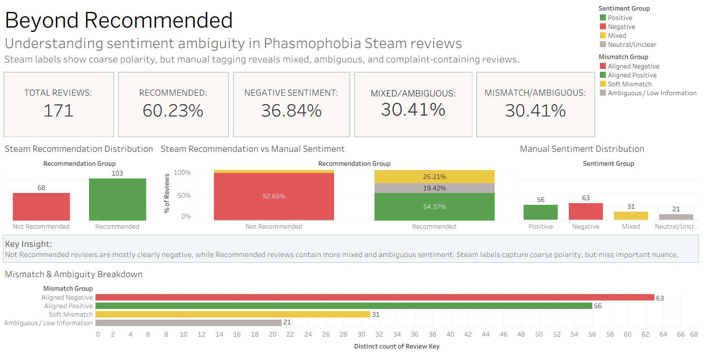
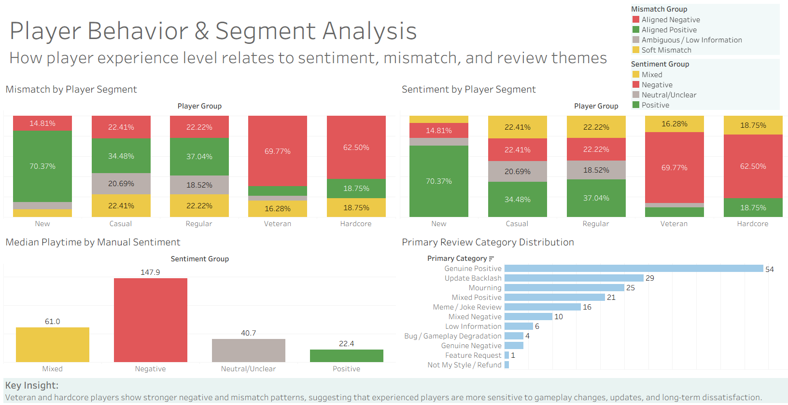
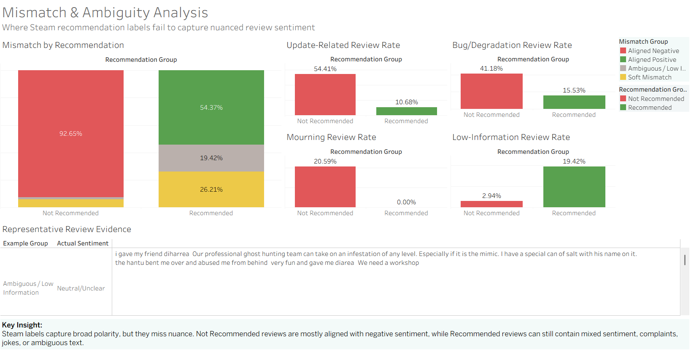
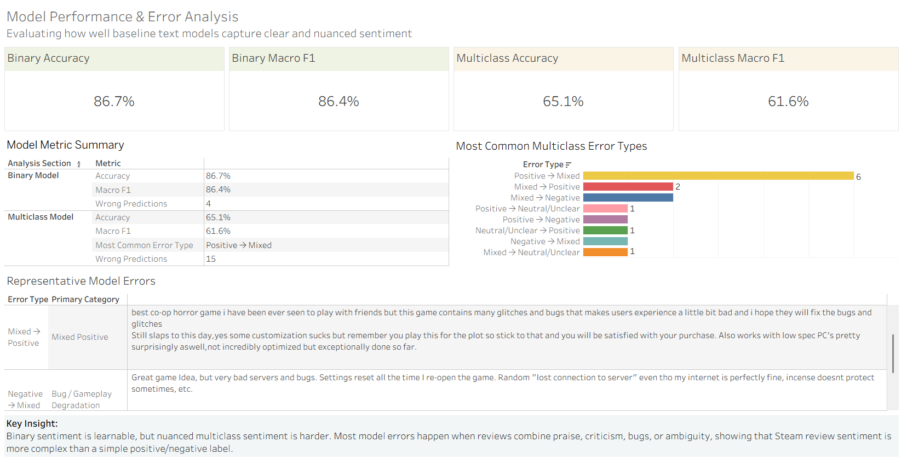

# Sentiment Analysis of Phasmophobia Steam Reviews

A text analytics and business intelligence project that examines whether Steam's binary **Recommended / Not Recommended** label fully represents the sentiment expressed in review text.

The project uses **Phasmophobia** reviews as a case study. It combines behavioral exploratory analysis, manual and assisted sentiment annotation, TF-IDF text classification, model error analysis, and a four-page Tableau dashboard.

---

## Project Overview

Steam reviews provide two related but different signals:

1. A binary recommendation label:
   - `Recommended`
   - `Not Recommended`

2. Free-form review text that may contain:
   - positive or negative sentiment
   - mixed opinions
   - sarcasm or meme language
   - complaints despite a positive recommendation
   - nostalgia or disappointment toward an older version of the game
   - low-information statements that do not clearly express sentiment

Because of this, the recommendation label does not always capture the full meaning of the review.

This project investigates the following question:

> **How much sentiment nuance is lost when Steam reviews are represented only by their binary recommendation label?**

---

## Main Objectives

The project was developed to:

- collect recent English-language Steam reviews
- analyze player behavior through playtime, review length, and engagement
- compare Steam recommendation labels with manually interpreted sentiment
- identify aligned, mixed, ambiguous, and mismatch review patterns
- train interpretable baseline sentiment models
- investigate the review types that are most difficult for the models
- present the findings through an interactive Tableau dashboard

---

## Key Results

### Dataset

| Stage | Number of reviews |
|---|---:|
| Expanded raw dataset | 262 |
| Pilot tagged dataset | 38 |
| Second tagged batch | 133 |
| Final combined tagged dataset | 171 |

### Recommendation distribution

| Steam label | Reviews |
|---|---:|
| Recommended | 103 |
| Not Recommended | 68 |

### Manual sentiment distribution

| Sentiment | Reviews |
|---|---:|
| Negative | 63 |
| Positive | 56 |
| Mixed | 31 |
| Neutral/Unclear | 21 |

### Main mismatch groups

| Group | Reviews |
|---|---:|
| Aligned Negative | 63 |
| Aligned Positive | 56 |
| Soft Mismatch | 31 |
| Ambiguous / Low Information | 21 |

### Baseline model performance

| Model | Accuracy | Macro F1 |
|---|---:|---:|
| Binary sentiment model | 86.7% | 86.4% |
| Multiclass sentiment model | 65.1% | 61.6% |

The binary model performs well when sentiment is reduced to clear positive and negative classes. Performance decreases in the multiclass setting because `Mixed` and `Neutral/Unclear` reviews contain more overlapping and inconsistent language.

---

## Main Findings

### 1. Negative recommendation labels are relatively direct

Most `Not Recommended` reviews in the tagged dataset also contain negative textual sentiment.

This suggests that negative Steam labels provide a fairly reliable coarse signal of dissatisfaction.

### 2. Recommended reviews contain more nuance

Some `Recommended` reviews include complaints, frustration, or mixed opinions.

These reviews do not necessarily represent direct contradictions. In many cases, the player still recommends the game overall while criticizing a specific update, bug, design decision, or change in gameplay quality.

### 3. Soft mismatch is more common than hard contradiction

The main mismatch pattern is not a fully positive label paired with completely negative text.

Instead, the more common pattern is:

```text
Recommended label + Mixed review text
```

This shows that binary recommendation systems can hide conditional or qualified opinions.

### 4. Ambiguous reviews are difficult to interpret

Short reactions, meme reviews, jokes, and low-information statements may receive a recommendation label without providing enough textual evidence for a clear sentiment interpretation.

### 5. Multiclass sentiment is substantially harder

The text model can distinguish clear positive and negative reviews reasonably well, but it struggles more with:

- mixed sentiment
- neutral or unclear language
- meme-style reviews
- low-information reviews
- reviews containing both praise and criticism

This is reflected in the difference between binary and multiclass model performance.

---

## Annotation Method

The final 171-row modeling dataset combines:

- **38 pilot manual annotations**
- **133 AI-assisted draft annotations**

The annotation taxonomy includes:

- `Positive`
- `Negative`
- `Mixed`
- `Neutral/Unclear`

Additional review categories were used to support qualitative analysis, including:

- genuine positive
- genuine negative
- update backlash
- bug complaint
- developer criticism
- mourning or nostalgia
- sarcasm
- meme
- low information

The `annotation_source` field is retained in the final dataset to make the annotation provenance explicit.

Because part of the dataset uses assisted draft annotation, the model results should be interpreted as **exploratory baseline results**, not as a definitive benchmark.

---

## Mismatch Taxonomy

The relationship between Steam recommendation and manually interpreted sentiment is summarized using the following groups:

| Mismatch group | Definition |
|---|---|
| Aligned Positive | Recommended + Positive |
| Aligned Negative | Not Recommended + Negative |
| Hard Mismatch | Recommendation label directly contradicts textual sentiment |
| Soft Mismatch | Recommendation label is paired with Mixed sentiment |
| Ambiguous / Low Information | Review text does not express enough clear evaluative sentiment |

For dashboard reporting, the main final groups are:

- Aligned Positive
- Aligned Negative
- Soft Mismatch
- Ambiguous / Low Information

---

## Modeling Approach

### Text representation

Review text is converted into TF-IDF features.

TF-IDF gives more weight to terms that are important within a review while reducing the influence of terms that appear frequently across the dataset.

### Classifier

The baseline models use Logistic Regression because it is:

- suitable for sparse TF-IDF features
- relatively interpretable
- efficient for a small labeled dataset
- useful for inspecting influential terms

### Modeling tasks

Three modeling experiments are included:

1. **Binary sentiment classification**
   - Positive
   - Negative

2. **Multiclass sentiment classification**
   - Positive
   - Negative
   - Mixed
   - Neutral/Unclear

3. **Mismatch / ambiguity classification**
   - exploratory supporting experiment

The binary sentiment model is saved as:

```text
models/baseline_binary_sentiment_tfidf_logreg.joblib
```

---

## Model Error Analysis

The project does not evaluate the models using accuracy alone.

The error analysis examines:

- actual and predicted class combinations
- error rate by sentiment class
- error rate by review category
- error rate by mismatch group
- review length and prediction errors
- representative wrong predictions

Final test-set error counts:

| Model | Wrong predictions |
|---|---:|
| Binary model | 4 |
| Multiclass model | 15 |

The multiclass errors are especially useful because they show where sentiment categories overlap semantically.

---

## Tableau Dashboard

The final Tableau dashboard contains four pages:

### Page 1: Executive Overview

Provides the main project KPIs:

- total tagged reviews
- recommendation distribution
- manual sentiment distribution
- aligned and mismatch review share



### Page 2: Player Behavior

Examines:

- sentiment by player segment
- mismatch by player segment
- playtime-related patterns
- review behavior across experience levels



### Page 3: Mismatch and Ambiguity

Explores:

- mismatch group distribution
- recommendation and sentiment relationships
- review themes and categories
- representative review examples



### Page 4: Model Performance

Presents:

- binary and multiclass metrics
- model error counts
- class-level performance
- representative wrong predictions



The packaged Tableau workbook is available at:

```text
dashboard/project_dashboard.twbx
```

---

## Project Workflow

```text
Steam Review API / pilot browser scraper
                |
                v
        Raw review datasets
                |
                v
       Cleaning and feature engineering
                |
                v
     Behavioral exploratory analysis
                |
                v
       Pilot manual annotation
                |
                v
 Expanded processing and second tagging batch
                |
                v
      Merge tagged datasets: 38 + 133
                |
                v
      TF-IDF + Logistic Regression
                |
                v
          Model error analysis
                |
                v
      Tableau dashboard preparation
```

---

## Repository Structure

```text
project/
├── README.md
├── requirements.txt
├── .gitignore
│
├── data/
│   ├── raw/
│   │   └── phasmophobia_reviews_expanded_raw.csv
│   │
│   ├── interim/
│   │   ├── data_for_manual_tagging.csv
│   │   ├── manual_tagging_candidates.csv
│   │   ├── manual_tagging_candidates_tagged.csv
│   │   ├── manual_tagging_batch_02.csv
│   │   └── phasmophobia_reviews_expanded_processed.csv
│   │
│   ├── processed/
│   │   ├── manual_tagging_analysis_ready.csv
│   │   ├── manual_tagging_batch_02_tagged_assistant.csv
│   │   ├── combined_tagged_reviews_after_batch02.csv
│   │   ├── combined_tagged_reviews_model_ready.csv
│   │   ├── binary_sentiment_predictions.csv
│   │   ├── multiclass_sentiment_predictions.csv
│   │   ├── binary_wrong_predictions_enriched.csv
│   │   ├── multiclass_wrong_predictions_enriched.csv
│   │   ├── model_error_analysis_summary.csv
│   │   └── dashboard_error_examples.csv
│   │
│   ├── dashboard/
│   │   ├── dashboard_review_level.csv
│   │   ├── dashboard_kpi_summary.csv
│   │   ├── dashboard_recommendation_sentiment_matrix.csv
│   │   ├── dashboard_mismatch_summary.csv
│   │   ├── dashboard_mismatch_by_recommendation.csv
│   │   ├── dashboard_category_summary.csv
│   │   ├── dashboard_player_sentiment_summary.csv
│   │   ├── dashboard_player_mismatch_summary.csv
│   │   ├── dashboard_theme_summary.csv
│   │   ├── dashboard_theme_by_recommendation.csv
│   │   ├── dashboard_model_summary.csv
│   │   ├── dashboard_error_examples_clean.csv
│   │   ├── dashboard_representative_examples.csv
│   │   └── README_dashboard_datasets.md
│   │
│   └── archive/
│       ├── phasmophobia_reviews_raw.csv
│       └── phasmophobia_reviews_processed.csv
│
├── notebooks/
│   ├── 01_manual_exploration.ipynb
│   ├── 02_behavioral_eda.ipynb
│   ├── 03_sentiment_mismatch_analysis.ipynb
│   ├── 04_dataset_expansion_and_sampling.ipynb
│   ├── 05_merge_tagged_data_and_baseline_model.ipynb
│   ├── 06_model_error_analysis.ipynb
│   └── 07_dashboard_dataset_prep.ipynb
│
├── scraper/
│   ├── scrape_steam_reviews_batch.py
│   ├── steam_review_scraper.py
│   └── utils.py
│
├── preprocessing/
│
├── models/
│   └── baseline_binary_sentiment_tfidf_logreg.joblib
│
└── dashboard/
    ├── project_dashboard.twbx
    └── screenshots/
        ├── 01.png
        ├── 02.png
        ├── 03.png
        └── 04.png
```

---

## How to Run the Project

### 1. Clone the repository

```bash
git clone <repository-url>
cd <repository-folder>
```

### 2. Create a virtual environment

Windows:

```bash
python -m venv .venv
.venv\Scripts\activate
```

macOS or Linux:

```bash
python -m venv .venv
source .venv/bin/activate
```

### 3. Install dependencies

```bash
pip install -r requirements.txt
```

### 4. Run the notebooks

Open Jupyter:

```bash
jupyter notebook
```

Run the notebooks in this order:

```text
01_manual_exploration.ipynb
02_behavioral_eda.ipynb
03_sentiment_mismatch_analysis.ipynb
04_dataset_expansion_and_sampling.ipynb
05_merge_tagged_data_and_baseline_model.ipynb
06_model_error_analysis.ipynb
07_dashboard_dataset_prep.ipynb
```

### Important manual steps

Notebook 02 exports a blank pilot tagging template.

Before Notebook 03, the completed file must exist at:

```text
data/interim/manual_tagging_candidates_tagged.csv
```

Notebook 04 exports the second tagging batch.

Before Notebook 05, the completed second batch must exist at:

```text
data/processed/manual_tagging_batch_02_tagged_assistant.csv
```

### Reproducing the frozen analysis

The repository already contains the frozen raw, tagged, processed, and prediction files used for the final results.

The Steam API scraper uses recent reviews. Running it again at a later date may produce a different raw dataset and therefore different results.

For exact reproduction of this portfolio project, use the committed frozen dataset rather than collecting new reviews.

---

## Scraper Usage

The main expanded-data scraper is:

```text
scraper/scrape_steam_reviews_batch.py
```

Run it from the project root:

```bash
python scraper/scrape_steam_reviews_batch.py
```

Output:

```text
data/raw/phasmophobia_reviews_expanded_raw.csv
```

The older Playwright-based script is retained as a pilot scraper:

```text
scraper/steam_review_scraper.py
```

The scraper is not required to reproduce the final frozen analysis.

---

## Dashboard Usage

Open:

```text
dashboard/project_dashboard.twbx
```

with Tableau Desktop or Tableau Reader.

The `.twbx` file packages the workbook and its local extracts, making it more portable than a standalone `.twb` file.

---

## Technologies

- Python
- Pandas
- NumPy
- Matplotlib
- Scikit-learn
- TF-IDF
- Logistic Regression
- Joblib
- Jupyter Notebook
- Requests
- Playwright
- Tableau

---

## Limitations

- The final tagged dataset contains only 171 reviews.
- The data focuses on one game and a specific review period.
- Steam recommendation labels are user decisions, not direct sentiment labels.
- Sentiment annotation contains subjective judgment.
- A portion of the labels was created through AI-assisted draft annotation.
- Sarcasm, memes, and short reviews remain difficult to classify.
- The class distribution is not fully balanced.
- The baseline models use TF-IDF and do not capture deeper contextual meaning.
- The results should not be generalized to all Steam games without additional validation.

---

## Possible Future Improvements

- increase the manually reviewed annotation set
- add inter-annotator agreement measurement
- evaluate transformer-based sentiment models
- compare multiple Steam games
- perform temporal analysis around major game updates
- add topic modeling for complaint themes
- separate sarcasm and meme detection into dedicated tasks
- deploy the model through a small interactive application
- publish the dashboard through Tableau Public

---

## Ethical and Data Considerations

The project analyzes publicly available Steam review text.

The dashboard and modeling datasets focus on review content and behavioral metadata. Public user identifiers are not needed for the final analysis and should be excluded from presentation-facing outputs.

The results are used for educational and portfolio purposes.

---

## Author

**Orlando Devito**  
Information Systems, Faculty of Computer Science  
Universitas Indonesia
